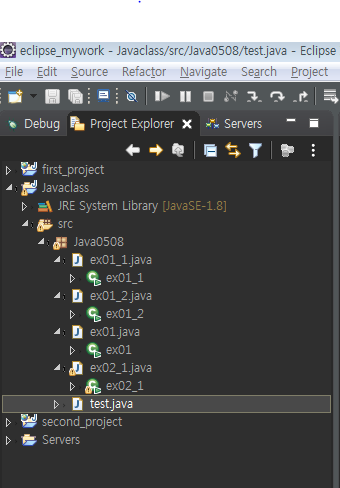

# java 설치, 설정

#### jdk 환경변수 설정
- 새로운 변수 설정
```shell
D:\dev\JAVA\JDK
```
- 새로운 path경로 생성 
- 맨 뒤에 \bin; 붙이는거 잊지 않기
```shell
C:\Program Files (x86)\VisualSVN\bin;%JAVA_HOME%\bin;
```


## eclipse

- [new] - [project...]- [java Project (Java)] 
- 새로운 프로젝트 생성
- [new] - [java pakage] - [패키지 생성(java0508)] 
- 생성된 java0508 패키지 안에 `ex01` 클래스 생성


 

```java


```


---------------------------------------------


# java  

#### public static void main(String[] args) 정리 파일

1. **public**

변수,함수,클래스 접근 제한 하는 문법이 있음 - 외부에서 잘못 변경되는 것을 막기 위해서

- public > protected > default > private

- public - 접근 제한 x

- protected - 동일한 패키지 내에 존재 , 파생클래스에서만 접근 가능

- default - 접근 제한자 명시 하지 않으면 default 값, 동일한 패키지 내에서 접근 가능

- private - 자기 자신의 클래스 내에서만 접근 가능

[출처](https://mainia.tistory.com/5574)


2. **static**

- 만드는 class 는 static 영역에 생성 , new 연산을 통해 생성한 객체 heap 영역

- heap 영영 메모리 garbage collector 통해 수시로 관리 받음

- Static 영역에 할당된 메모리 장점 =>  모든 객체가 공유하는 메모리
	      
- Garbage collector 관리 영역 밖에 존재하므로 static 자주 사용하면 종료시까지 메모리가 할당된 채로 존재

[출처](https://mangkyu.tistory.com/47)

3. **void**

- 자바 리턴값이 없을 때 void 함수 사용

4. **main()**

- java 실행 시 제일 먼저 실행 시키겠다


5.**String[] args**

- String - 문자열

- [] - 연속적인 데이터를 하나의 변수를 넣고 싶을때

- args -단순한 변수 명

